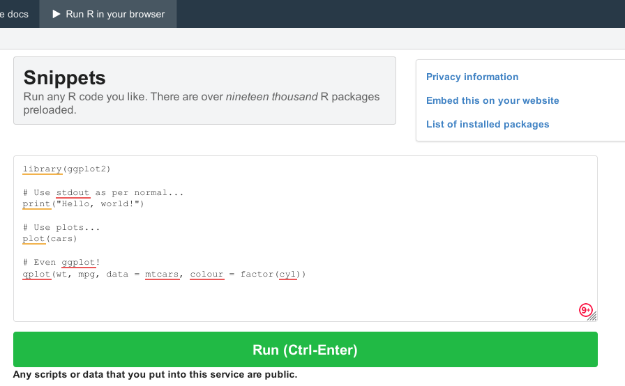
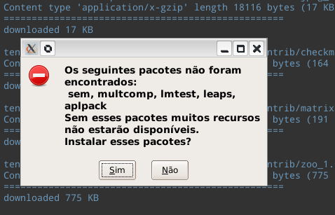
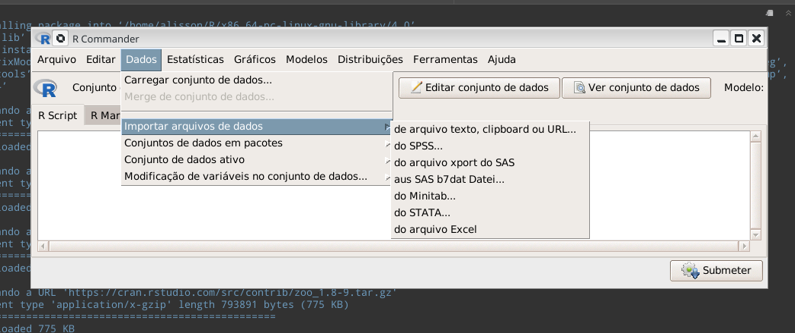

# Introdução ao R

::: {.infobox .objetivo data-latex="{objetivo}"}
Objetivos do capítulo:

- 1) Apresentar como obter ajuda no R
- 2) Apresentar os tipos de dados e as estruturas de dados no R
- 3) Apresentar a suíte de pacotes do tidyverse
:::

O R vem com diversos pacotes e funções nativamente. Só para ter uma idéia desta quantidade:

|Pacote|Número de funções|
|----|----|
|base| 1244 |
|datasets| 104 |
|graphics| 87 |
|grDevices| 112 |
|methods| 203 |
|utils| 215 |
|stats| 449 |

Dificilmente vamos dominar todos estes e mais as funçoes dos pacotes específicos.

Supondo que já tenha o R e o RStudio instalados (há diversos tutoriais de instalação no Youtube), vamos aos primeiros passos.

É possível também rodar o R de modo online, de modo gratuito, sem instalar nada em seu computador, com o
[One Compiler](https://onecompiler.com/r) e o [Snippets](https://rdrr.io/snippets/), tendo mais de 19 mil pacotes instalados. O lado negativo é que não é um modo prático e tão rápido como rodar em seu computador, mas pode servir para pequenos testes.

{width=50%} 

## Obtendo Ajuda no R
A primeira coisa a se aprender é como conseguir ajuda, como conseguir a informação que precisamos. 
A busca por ajuda é uma constante, mesmo entre os mais experiente. 

|Comando|Descrição|Exemplo de uso|
|---|---|---|
|`help.start()` | para abrir o sistema de ajuda em HTML no seu navegador|`help.start()`|
|`help("função")` ou `?funcao()`|Acesso à documentação de funções, data sets e outros. No Rstudio, a ajuda é aberta na aba "Help". Caso rode direto no console, sem o RStudio, uma vez dentro da página de ajuda, digite `/` para realizar busca  e `q` para sair|`?getwd` ou `help(getwd)`|
|`help(função, package="NOME_PACOTE")`| para obter ajudar de um pacote que não foi cerregado|`help(rlm, package="MASS")` Ajuda para a função rlm() do pacote MASS|
|`help(package = 'NOME_PACOTE')`|Mostra um índice de páginas de ajuda para o pacote|`help(package = 'dplyr'`|
|`example()`|Mostra exemplos de uso da função |`example(grep)`|
|`help.search()` ou `??busca`|Para busca mais vaga. Caso não se lembre do nome exato da função, ou caso busque uma função que faça determinada tarefa|`??regression` mostra diversas funções de diversos pacotes que contém a palavra "regression"|
|`RSiteSearch()`|Busca no seu navegador (browser) padrão em sites especializados em R|`RSiteSearch("text analysis")`|
|`args()`|Mostra os argumentos que uma função pode receber.|`args(grep)`|
|`apropos()`|Busca pelo nome de uma função. Útil quando não lembramos exatamente o nome de uma função|`apropos("grep")`|
|`demo()`| Lista todas as demonstrações de todos os seus pacotes |`demo()`|
|`demo(package="package-name")`| lista as demonstrações de um pacote particular | `demo(package="stats")`|
|`pacote::`|No console do RStudio, apresenta uma lista com todas as funções do pacote, numa janela|`graphics::`|

Fonte: Versão expandidada de [Getting Help with R](https://www.r-project.org/help.html).


```{r, collapse=TRUE}
# Buscando por funções que contenham "grep"
apropos("grep")

# Mostrando os argumentos que uma função pode receber
args(gsub)
```

Outra dica é buscar a documentação do pacote no [site do cran](https://cran.r-project.org/search.html) ou buscar por problemas específicos no o site [Stack Overflow](https://stackoverflow.com/).


### Obtendo ajuda com o R Commander (Rcmdr)
Para quem está aprendendo a usar estatística no R, uma boa dica é usar o pacote R Commander. 
Ao rodá-lo, uma janela aparece onde escolhemos o tipo de operação, e ele mostra o código para tal.
O Rcmdr ensina como importar dados (SPSS, Excell, Stata, ruls, etc.), como realizar diversas operações estatísticas, como plotar gráficos.

```{r, eval=FALSE, echo=FALSE, collapse=TRUE}
install.packages('Rcmdr') # instalando o pacote
library(Rcmdr) # carregando o pacote R Commander
```

Ao rodar o Rcmdr pela primeira vez, pacotes adicionais serão instalados, como na imagem abaixo.



Após a instalação de pacotes adicionais, O R Commander abre uma janela com os comandos.

 

Caso feche a janela do RCommander, rodar `library(Rcmdr)` novamente não abrirá a janela, uma vez que o pacote já está carregado.  A solução é rodar então `Commander()` para ter a janela novamente. Caso queira fechar este pacote, basta digitar no Console `detach("package:Rcmdr", unload=TRUE)` ou apenas feche o R.


::: {.infobox .note data-latex="{dica}"}
**Dicas**: R Commander

- LAURETTO, Marcelo. [Introdução ao R Commander](http://www.each.usp.br/lauretto/cursoR2017/02-RcommanderParte1.pdf). (Pequeno tutorial do RCommander, em PDF e em português.)
- [The R Commander: A Basic-Statistics GUI for R](https://socialsciences.mcmaster.ca/jfox/Misc/Rcmdr/)
- FOX, John. [Getting Started With the R Commander](https://socialsciences.mcmaster.ca/jfox/Misc/Rcmdr/Getting-Started-with-the-Rcmdr.pdf). (Artigo do criador do RCommander)
- Video tutorial do Rcommander em ação e em português: 
[Aprendendo Estatística com o R Commander](https://www.youtube.com/watch?v=7GDshWv8O6E) do Departamento de Estatística UFLA
:::

### Comentando o código
Nas linguagens de programação é possível acrescentar comentários para orientar os humanos e que não serão lidos pelo computador. Cada linguagem tem o seu próprio padrão. 
No R, assim como em muitas linguagens de programação, os comentários no código são feito com a tralha `#` ou hashtag, jogo da velha, etc. Tudo que vier depois deste símbolo é então ignorado.

```{r, collapse=TRUE}
print("Olá mundo!")
print("Olá mundo R!") # comentário que o computador ignora
```
Se retirarmos o símbolo `#` temos então mensagem de erro.

<!-- ```{r, eval=FALSE, error=TRUE, collapse=TRUE}  -->
<!--  print("Olá mundo! Olá R")  comentários que dará erro -->
<!-- ``` -->

 
```
print("Olá mundo! Olá R")  comentários que dará erro
Error: unexpected symbol in "print("Olá mundo! Olá R")  comentários"
Execution halted
```

## Tipos de Dados no R (data types) {#RDataTypes}

> "Tudo que existe no R é um objeto" (John Chambers, _apud_ [WICKHAM](https://adv-r.hadley.nz/base-types.html))

Tipos de dados se referem à forma mais simples de objetos, ou tipos de dados atômicos do R (R atomic data types)
<!-- Everything in R programming language is an object. Hence, when we talk about data types in R we refer to the simplest data objects we can handle, that are also known as R atomic data types. https://r-coder.com/data-types-r/#Raw_data_type_in_R -->
Há cerca de [25 tipos de dados no R, ou "base types"](https://adv-r.hadley.nz/base-types.html), mas  
os cinco tipos de dados mais frequentes são:

||Tipo de dado no R| Exemplo de uso|
|--|---|----|
|1| character (texto)| "a", "bla", "Fulano de tal"|
|2| numeric (real ou decimal)| `2`, `43`|
|3| integer (integral) | `3L` (O "L" é o modo que o R entende que é um integral) |
|4| logical (lógico)| `TRUE` ou `FALSE`|
|5| complex (complexo)| `1+4i` (números complexos com partes reais e imaginárias)|

<!-- |6| [raw](https://stat.ethz.ch/R-manual/R-devel/library/base/html/raw.html) | `charToRaw("bla")`, `intToBits(5L)` Trabalha com bytes e é de uso raro|  -->


Uma vez criados os dados, para examinar as características dos objetos há algumas funções no R

|Função no R para examinar tipos de dados| Descrição |Exemplo|
|---|---|---|
|`class()`|Que tipo de objeto é?|`class(3)`, `class("bla")`|
|`length()`|Qual o tamanho dos vetores? Quantos itens possui? | `length(c("bla","ble"))`|
|`attributes()`|Possui metadados?||

<!-- |`class()`|Que tipo de objeto é (high-level)?|| -->
<!-- |`typeof()`|Qual to tipo de dado (data type) do objeto (low-level)?|| -->
<!-- What about two dimensional objects?| -->

```{r, collapse=TRUE}
# Criando um texto (character). Tem de ser delimitado entre aspas
minha_variavel_texto <- "bla"
minha_variavel_texto 
class(minha_variavel_texto)

# Criando uma variável numérica. Não pode ser delimitado por aspas.
minha_variavel_numerica <- 2
minha_variavel_numerica
class(minha_variavel_numerica)

# Criando um integral:
minha_variavel_integral <- 5L
minha_variavel_integral
class(minha_variavel_integral)

# Criando um variável lógica. Também sem aspas.
## 5 é maior que 3?
minha_variavel_logica <- 5 > 3
minha_variavel_logica
class(minha_variavel_logica)
## 5 é menor que 3?
minha_variavel_logica2 <- 5 < 3
minha_variavel_logica2
minha_variavel_logica3 <- TRUE # É possível atribuir
minha_variavel_logica3
minha_variavel_logica4 <- F # Também é possível usar abreviaturas "T" e "F"
minha_variavel_logica4

# Criando um número complexo:
numero_complexo <- 3 + 2i     
numero_complexo
class(numero_complexo)
```
<!-- # Criando um Raw a partir de texto: -->
<!-- meu_raw <- charToRaw("Análise textual") -->
<!-- meu_raw -->
<!-- class(meu_raw) -->
<!-- ## Criando Raw a partir de um integral: -->
<!-- raw_integ <- intToBits(2L) -->
<!-- raw_integ -->
<!-- class(raw_integ) -->

Na criação de tipos de dados, pode-se usar de coerção (coercion) através das funções `as.`

|Função|Coerção para|
|---|---|
|`as.numeric`|Numeric|
|`as.integer`|Integer|
|`as.double`|Double|
|`as.character`|Character|
|`as.logical`|Boolean|

<!-- |`as.raw`|Raw| -->


::: {.infobox .obra data-latex="{construcao}"}
_EM CONSTRUÇÃO_
:::

## Estrutura de dados no R (Data Structures)

::: {.infobox .obra data-latex="{construcao}"}
_EM CONSTRUÇÃO_
:::

Vimos os tipos de dados. 
Estes podem ser organizados de distintos modos, e a depender desta organização, temos diferentes estruturas de dados.
O R possui diversas estruturas de dados, como:

- vetores numéricos e atômicos
- lista (_list_)
- fatores (_factors_)
- matriz (_matrix_)
- data frame


### Vetor (vector)
Vetor é a estrutura de dados mais comum no R. Criamos vetores com a função `c()`  de "concatenate" ou "combine".
No caso de strings (character), deve-se colocar os valores dentro de aspas:

```{r, collapse=TRUE}
meu_vetor <- c("bla", "bla", "ble", "bli") # criando o vetor com strings
meu_vetor # imprimindo na tela o vetor que acabamos de criar
class(meu_vetor)

length(meu_vetor) # observando quantos itens possui nosso vetor

meu_vetor[3]  # acessando o item do 3 de nosso vetor

# Criando um vetor de valores booleanos
# Não se usa aspas nesse caso
vetor_logico <- c(TRUE, FALSE, FALSE) # criando um vetor de valores booleanos
class(vetor_logico)

# Criando um vetor com diferentes tipo de dados
vetor_pan <- c("bla", 3, TRUE, 5L)
vetor_pan

# criando uma sequência numérica de 2 a 8. Desta vez não iremos salvar em uma variável
c(2:8) 
```


Vetores podem ser de dois tipos: 1) atômicos, ou 2) listas. Mas o mais frequênte é encontrarmos "vetor" como sinônimo de "vetor atômico", e listas serem consideradas como algo à parte.
<!-- although the term “vector” most commonly refers to the atomic types not to lists. -->
Para examinarmos os vetores, podemos usar as funções:
`typeof()`, `length()`, `class()` e `str()`

É ainda possível também atribuir nomes aos elementos de um vetor usando a função `names()`

```{r, collapse=TRUE}
valores <-  c(12, 34, 13) # Criando um vetor de valores
nomes <- c("banana", "uva", "abacate") # Criando vetor com os nomes
names(valores) <- nomes # atribuindo o vetor "nomes" como titulo do vetor "valores"
valores # imprimindo o vetor com nomes e valores
names(valores) # imprimindo apenas os nomes

class(valores)
```


### Fator (_Factor_)
Considere a seguinte tabela fictícia:

|Nome|Altura(cm)|Região do país|
|-|-|-|
|Fulano|175|NE|
|Ciclano|134|SE|
|Beltrano|166|S|
|João|187|S|
|Maria|173|NE|
|José|159|CO|
|Joaquim|161|SE|


Se em uma coluna certos valores se repetem, podemos considerá-los como "fatores". No caso a coluna "Nome" possui valores únicos, a coluta "Altura" também, mas a coluna "Região" possui uma quantidade limitada de valores que se repetirão: N,S,NO,SE,CO. Podemos então considerar os valores desta coluna como "fatores".
Fatores podem ser tanto strings, como no caso acima, como integrais, como no caso da idade de estudantes de uma mesma turma.

Um exemplo prático:

```{r cars, echo = TRUE, error=TRUE, collapse=T}
# Criando um vetor de caracteres com siglas de aeroportos brasileiros
aeroportos <- c("BSB", "CON", "BSB", "VIC", "GUA", "FOR", "MAO","GUA", "CON", "CON", "REC", "UDI", "VIC", "GUA")
summary(aeroportos)

# Se tento criar um barplot com os valores, dá erro:
barplot(summary(aeroportos))

# Temos de transformar os dados em um fator, que vamos chamar de "aeroportos.factor"
aeroportos.fator <- factor(aeroportos)
aeroportos.fator # Perceba que "Levels" mostra os valores sem repetição
summary(aeroportos.fator) # Mostrando a frequência de cada termo com a função 'summary()'

# Agora é possível gerar o gráfico de barras (barplot)
barplot(summary(aeroportos.fator))
```    

Fatores são comuns em tabelas, mas são raros em análise textual. Assim, ao trabalhar com análise textual, convém mudar as opções globais de strings, para não serem consideradas fatores:

```{r}
options(stringsAsFactors = FALSE)
```


### Matriz (Matrix) {#matrix}
Vejamos as matrizes:

```{r, collapse=TRUE}
# 1:12=Os elementos da nossa matriz, 1 a 12
# 4=linhas no eixo vertical 3=linhas noeixo horizontal
minha.matriz <- matrix(1:12, 4, 3)
minha.matriz

# Acessando itens, linha 2, coluna 3
minha.matriz[2, 3]

# Acessando uma linha inteira
minha.matriz[2, ]
```
Matrizes também são usadas na análise textual, como nas [Document-Term-Matrix](#DTM) e TermDocument Matrix. Veremos em mais detalhes posteriormente, mas apenas para um primeiro contato, o DTM das frases "O rato roeu a roupa do rei", "O rei riu do rato", "A roupa do rato é de rei", onde cada linha representa um documento (documento, neste caso, é cada uma das frases) e as colunas são as palavras. Os números são a frequência de cada termo em cada frase:


<!-- |    | Documentoss| -->
<!-- |-----|-----| -->
<!-- |*Termos*|1 |2 |3| -->
<!-- |  rato  |1 |1 |1| -->
<!-- |  rei   |1 |1 |1| -->
<!-- |  riu   |0 |1 |0| -->
<!-- |  roeu  |1 |0 |0| -->
<!-- |  roupa |1 |0 |1| -->


<!-- |  |  |  |  | -->
<!-- |----|----|---|---| -->
<!-- |**termos**|1 |2 |3| -->
<!-- |  rato  |1 |1 |1| -->
<!-- |  rei   |1 |1 |1| -->
<!-- |  riu   |0 |1 |0| -->
<!-- |  roeu  |1 |0 |0| -->
<!-- |  roupa |1 |0 |1| -->

```{r, echo=FALSE, include = F, results = "hide"}
library(tm)
library(tm)
texto=c("O rato roeu a roupa do rei", "O rei riu do rato", "A roupa do rato é de rei")
myCorpus <- data.frame(texto)
corpus <- Corpus(VectorSource(myCorpus$texto))
x <- inspect(DocumentTermMatrix(corpus))
```

```{r, echo=FALSE}
knitr::kable(
  x,booktabs = TRUE,
  caption = 'Um exemplo de DTM'
)
```


### Listas (_list_)
Listas são conjuntos de vetores mais simples.
Para criar uma lista, basta usar o comando `list()`

```{r, collapse=TRUE}
minha_lista = list(c(T,T,F), "Joaquim José da Silva Xavier", c(3,6,3,67,22) )
minha_lista

# Acessando o vetor 3 de nossa lista. No caso de listas, usamos o duplo colchete
minha_lista[[3]]

# Acessando o vetor 3 de nossa lista, item 5
minha_lista[[3]][5]
```

É possível também "quebrar" um texto em vetores, através do comando `strsplt()`

```{r, collapse=T}
texto = "Bla bla bla. Ble ble ble ble. Bli bli. Blo. Blu blu blu"
class(texto)

strsplit(texto, "\\.")
```
No exemplo acima, o primeiro argumento em strplit() é a variável, o segundo argumento é o critério a ser usado para quebrar o texto. Alguns caracteres são considerados especiais e precisam ser indicados que queremos seu significado literal. É o caso de ponto final. Para conseguirmos usá-lo como ponto final, ao invés de usarmos `"."`, usamos `\\.` . Note que ficaram espaços no início dos elementos dos vetores. Podemos melhorar nosso código acrescentando um espaço em branco após o ponto final:

```{r, collapse=TRUE}
strsplit(texto, "\\. ")
```
Se examinarmos o tipo de arquivo que temos, veremos que se trata de uma lista:
```{r, collapse=TRUE}
texto2 <- strsplit(texto, "\\. ")
class(texto2)
```
Se quisermos que este seja um vetor simples, e não lista:
```{r, collapse=TRUE}
class(texto2)

# usar o comando unlist()
unlist(texto2)
class(unlist(texto2))

# Ou ainda, acessando o item 1 da lista
strsplit(texto, "\\. ")[[1]]

```


### Data Frames
Uma vantagem de se trabalhar com data frame é que as colunas tem nome e não apenas índice, e isto facilita nosso trabalho na hora de procurar as informações que queremos, pois buscar a coluna pelo seu número pode nos causar confusão.

<!-- escolaridade <- as.integer(c(08,13,15))  -->

```{r, collapse=T}
# Criando 3 vetores com os valores
idade <-  as.integer(c(12,23,35)) 
genero <- as.character(c("fem", "mas", "fem")) 
raça <- as.character(c("pret", "branc", "pard")) 

# jogando estes vetores no nosso dataframe que vamos nomear de "df"
df <- data.frame(idade, genero, raça) 
df # vendo nosso dataframe no console

View(df) # ver o dataframe em uma nova janela pop-up

class(df) # Qual a classe de nosso objeto, caso tenhamos esquecido?

names(df) # retornando apenas o nome das colunas

df$genero # Filtrando o dataframe "df" pela coluna "genero"

df[2] # Filtrando o dataframe pela coluna 2: df[numero] 

df[,2] # Filtrando o dataframe pela coluna 2:

# Filtrando o dataframe pelo número da linha: df[número_da_Linha,] . Repare na necessidade da vírgula.
df[1,] # imprimindo a linha 1

df[3,] # imprimindo a linha 3

df[1:2,] # retornando as linhas de 1 a 2

# media da coluna "idade"
mean(df$idade)

summary(df) # Obtendo uma visão estatística ampla da tabela
summary(df$genero) # sumário da coluna "gênero" do dataset "df"
summary(df$idade) # sumário da coluna "idade" do dataset "df"

# testando se valores da coluna "genero" são "fem"
 df$genero=="fem"

# Filtrando apenas as linhas onde a coluna "genero" for "fem". 
# Explicando de outro modo: quando "genero" igual a "fem" for verdadeiro, imprima
df[df$genero=="fem",]

# Filtrando apenas as linhas onde a escolaridade for maior que 12. 
df[df$idade > 12,]
```
### Considerações finais sobre estrutura de dados
Estes não são os únicos tipos de estrutura de dados no R. Alguns pacotes podem criar o seu próprio tipo e não convém tentar cobrir todos.
Apesar de considerar tipos diferentes, podemos considerar os diferentes tipos como subcategorias de outras.
Data frames são um tipo restrito de listas. Listas, por sua vez, são um tipo de vetor.
Veremos a seguir a suíte de pacotes do `tidyverse` que possui formato próprio de dados.

## A suíte de pacotes `tidyverse`


::: {.infobox .obra data-latex="{construcao}"}
_EM CONSTRUÇÃO_
:::

