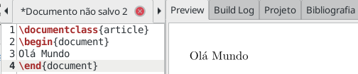
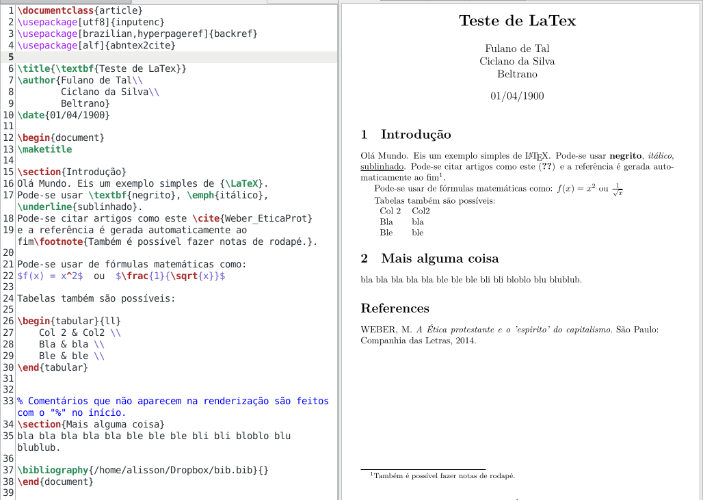
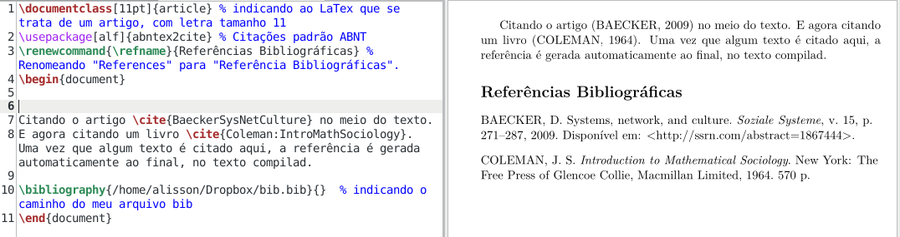
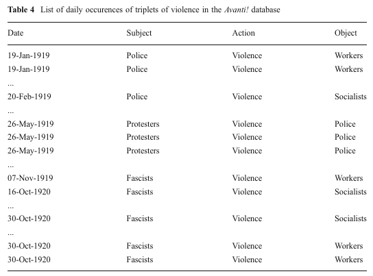
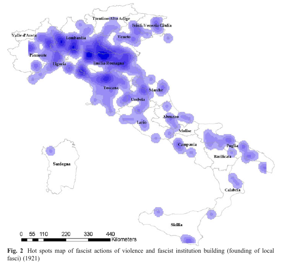

# Organização dos dados quanto a sua estrutura

::: {.infobox .objetivo data-latex="{objetivo}"}
Objetivos do capítulo:

- 1) Apresentar a distinção entre dados estruturados, dados não estruturados e dados semi estruturados
- 2) Apresentar alguns formatos de arquivos frequentes na análise textual e humanidades digitais, como csv e tsv, Json, markdown, yaml, LaTex, BibTex, xml e html.
:::

  Podemos pensar a organização de dados quanto à sua estrutura de três formas: dados estruturados, dados semi estruturados e dados não estruturados.
  <!-- De modo resumido, podemos dizer que dados estruturados são como tabelas -->
  
## Dados estruturados
  
  Formatos de arquivos estruturados são
csv,xml, json, xls, xlsx, etc.
Muitos destes possuem formato de tabela, o que torna bastante fácil encontrar a informação buscada.

### Os formatos csv (_comma separeted values_) e tsv.
O formato csv (_comma separeted values_ ou "valores separados por vírgula") é um dos mais simples, consiste de arquivo de texto simples, com valores separados por um caractere (ou conjunto de caracteres) que separam os valores em cada linha, sendo geralmente vírgula ou ponto e vírgula ou tabulação (tecla tab). Qualquer caractere ou conjunto de caracteres pode ser usado como separador de campos.
Na imensa maioria dos casos cada linha é separada pela quebra de linha. 
Por exemplo, a seguinte tabela:
  
  |Estado | sigla | capital| região|
  |------|----|-----|-----|
  |Acre |AC |Rio Branco |Norte|
  |Alagoas |AL |Maceió |Nordeste|
  |Amapá |AP |Macapá |Norte|
  |Amazonas |AM |Manaus |Norte|
  |Bahia |BA |Salvador |Nordeste|
  |Ceará |CE |Fortaleza |Nordeste|
  
  Em abrirmos o csv no bloco de notas (notepad):
  
  ```
Estado;sigla;capital;região;
Acre;AC;Rio Branco;Norte;
Alagoas;AL;Maceió;Nordeste;
Amapá;AP;Macapá;Norte;
Amazonas;AM;Manaus;Norte;
Bahia;BA;Salvador;Nordeste;
Ceará;CE;Fortaleza;Nordeste;
```
O separador de campo neste arquivo CSV é o ponto e vírgula `;`.
Ao pedirmos ao computador para localizar qual a designação da sigla "AP", ele saberá buscar facilmente esta informação.

No caso ali, a vírgula é o separador de campos, mas qualquer outro caractere pode ser usado como separador. 
O formato .tsv, por exemplo, é separado por tabulação - ou o símbolo `\t`.
Mas é possível encontrar arquivo csv, porém com separador tipo "\t" ou ";".

<!--O XML, por exemplo:
  ```
<note>
  <to>Ciclano</to>
  <from>Fulano</from>
  <heading>lembrete</heading>
  <body>Não esqueça de trazer pão!</body>
  </note>
  ```-->
### O formato Json {#formatoJson}
O [Json](https://www.json.org/json-pt.html) ("JavaScript Object Notation", isto é "Notação de Objetos JavaScript"), é organizado no esquema de pares nome/valor.
Por exemplo, ao separarmos primeiro nome `firstName` de sobrenome `lastName` no Json:
  
  <!--```
{
  "id":1,
  "nome":"Fulano de tal",
  "endereco":"R. Qualquer",
  "idade": 35
}
```
ou ainda-->

```{r, engine = 'js', eval=FALSE, echo =TRUE, include=TRUE}
{"employees":[
  { "firstName":"João", "lastName":"da Silva" },
  { "firstName":"Ana", "lastName":"Maria" },
  { "firstName":"Joaquim", "lastName":"Xavier" }
]}
```

- O arquivo json inicia e termina com colchetes `[]`
- Todo Json é delimitado por chaves `{}`, 
- os dados são representados no esquema nome/valor ``"nome": "valor"`. 
- estes são separados por vírgula.


::: {.infobox .note data-latex="{dica}"}
**DICA:** Caso queira mais detalhes sobre o formato Json: 
  
- Video introdutório sobre o formato Json do canal Código Fonte TV [JSON // Dicionário do Programador](https://www.youtube.com/watch?v=P81dE-tkaaA).
- Video introdutório, porém mais prático, focado na estrutura do mesmo: [JSON em 6 minutos](https://www.youtube.com/watch?v=3MREC-YEQG4) do canal "Canal TI".
- Para ver as [regras de sintaxe do Json](https://www.w3schools.com/js/js_json_syntax.asp).
:::

  
## Dados não estruturados
Os dados não estruturados são a forma como encontramos em livros impressos, artigos, jornais, revistas, etc. São a forma de texto que nós humanos lemos normalmente. Por exemplo:

> "Algum tempo hesitei se devia abrir estas memorias pelo principio ou pelo fim, isto é, se poria em primeiro logar o meu nascimento ou a minha morte. Supposto o uso vulgar seja começar pelo nascimento, duas considerações me levaram a adoptar differente methodo: a primeira é que eu não sou propriamente um autor defunto, mas um defunto autor, para quem a campa foi outro berço; a segunda é que o escripto ficaria assim mais galante e mais novo. Moysés, que tambem contou a sua morte, não a poz no introito, mas no cabo: differença radical entre este livro e o Pentateuco...."

Este tipo de texto, não estruturado, é alvo do Processamento de linguagem natural (PLN)/ _Natural Language Process_ (NLP).


## Dados semi-estruturados
Dados semi-estruturados são um meio termo entre os estruturados e os semi estruturados. Por vezes são chamados de "auto-descritivos". Vejamos exemplos destes.

### Exemplos de dados semi-estruturados

#### Markup
Códigos especiais, ou linguagem “markup” é uma notação de documento que tem duas apresentações, uma simplificada como texto normal para humanos, e outra com os "markup" para que o computador entenda. 

### O formato Markdown {#formatoMarkdown}
Um exemplo bem simples de markup é o `Mardown`, usado na escrita rápida de textos. 


### O formato YAML {#formatoYaml}
O [YAML](http://yaml.org/) ("YAML Ain't Markup Language") é um padrão de serialização de dados que prima por ser "human friendly", isto é, de fácil leittura também para humanos.
Em arquivos `markdown` tem-se usado o `yaml` como cabeçalho, com informações para a renderização do pdf, como título, subtítulo, resumo, palavras chave, etc. Ao converter markdown para o formato final, o computador irá interpretar estas informações.
Um exemplo de yaml no arquivo markdown:
  
```{r, eval=FALSE, echo =TRUE, include=TRUE}
---
title: "Título do meu pdf"
subtitle: subtitulo qualquer
author: Fulano de Tal
# comentário qualquer
fontsize: 12pt
urlcolor: blue
geometry: margin=2.5cm
abstract: >
  meu resumo bla bla bla bla
---
# Titulo 
Texto texto  texto  texto  texto  texto  texto 

## Subtitulo 
Texto texto  texto  texto  texto  texto  texto 
```

O cabeçalho em yaml é delimitado no seu início e fim por três traços consecutivos `---`.
Repare que o símbolo tralha `#` dentro do yml é interepretado como comentário, já no markdown, indica capítulo.


::: {.infobox .note data-latex="{dica}"}
**DICA:** <br>
Um modo prático de trabalhar na elaboração de textos - principalmente acadêmicos -  com markdown e yaml é renderizá-lo com o [pandoc](https://pandoc.org/), que é um canivete suíço na transformação de formatos de texto. Com ele, pode-se criar pdfs, html, doc, docs, odt, etc. a partir de seu arquivo markdown. Pandoc funciona via linha de comando.
:::

<!--
  # Título
  Exemplo de arquivo em `Markdown`, um tipo de markup, onde é possível fazer **negrito**, *itálico*, _sublinhado_ em texto puro, e um interpretador/conversor transforma este texto puro em texto formatado, que podemos exportar para pdf .docx .odt e vários outros formatos de texto.

> "Pode-se fazer uma citação" (ALGUÉM, 2005)

Aqui um texto de comentário. Ele aparece aqui, mas não aparece no texto renderizado

## Subtítulo 2
Aqui podemos colocar mais texto, ou fazer tabelas: 
  
  |col 1 | col 2 |
  |------|---|
  | bla | bla |
  | ble | ble |
  -->
  
### O Formato LaTex {#formatoLatex}
O LaTex é uma linguagem usada na confecção, principalmente de textos (livros, artigos) acadêmicos, bem como apresentações. O formato LaTex permite grande flexibilidade, e é muito usado para escrever fórmulas matemáticas e gerar as referências bibliográficas automaticamente. Por isso, o LaTex é muito usado no contexto acadêmico. O seu formato mínimo pode ser visto assim:
  
  <!--
  \documentclass{article}
\usepackage[utf8]{inputenc}	
\usepackage[brazilian,hyperpageref]{backref}
\usepackage[alf]{abntex2cite}

\title{\textbf{Teste de LaTex}}
\author{Fulano de Tal\\
  Ciclano da Silva\\
  Beltrano}
\date{01/04/1900}

\begin{document}
\maketitle

\section{Introdução}
Olá Mundo. Eis um exemplo simples de {\LaTeX}.
Pode-se usar \textbf{negrito}, \emph{itálico}, \underline{sublinhado}.
Pode-se citar artigos como este \cite{Weber_EticaProt}
e a referência é gerada automaticamente ao fim\footnote{Também é possível fazer notas de rodapé.}. 

Pode-se usar de fórmulas matemáticas como:
  $f(x) = x^2$  ou  $\frac{1}{\sqrt{x}}$
  
  Tabelas também são possíveis:
  
  \begin{tabular}{ll}
Col 2 & Col2 \\
Bla & bla \\
Ble & ble \\
\end{tabular}

% Comentários que não aparecem na renderização são feitos com o "%" no início.
\section{Mais alguma coisa} 
bla bla bla bla bla ble ble ble bli bli bloblo blu blublub.

\bibliography{/home/alisson/Dropbox/bib.bib}{}
\end{document}
-->

```{r, eval=FALSE, echo =TRUE, include=TRUE}
\documentclass{article}
\begin{document}
Olá Mundo
\end{document}
```



Ou em um exemplo um pouco mais elaborado:



Perceba que antes de `\begin{document}`, isto é, no cabeçalho do documento temos várias informações, entre elas o título do artigo na linha 5 em `title{}`, e em `\author{}`, nas linhas de 6 a 8, temos os autores. Temos também delimitados os capítulos ou seções, no caso ali em `section{}`. 


::: {.infobox .note data-latex="{dica}"}
**DICA:** <br>
Para renderizar textos .tex em pdfs deve-se usar um interpretador. O [pandoc](https://pandoc.org/MANUAL.html) é uma opção. Embora seja possível usar apenas o interpretador/conversor e um bloco de notas, o mais comum em Tex e LaTex é usar algum programa focado. O [TeXstudio](https://www.texstudio.org/) é uma boa opção. 
Caso use Linux e queria a renderização à medida que edita o texto, olhe o [Gummi](https://www.gummi.app/). 
Caso queira fazer os documentos em LaTex sem ter de "programar", dê uma olhada no [LyX](https://www.lyx.org/). 
Há também editores de LaTex online, como o [overleaf](https://www.overleaf.com/), que possibilita trabalhar em equipe, observando as alterações feitas por cada pessoa
:::

### O formato BibTex {#formatoBibtex}
Um formato "irmão" do LaTex e markdown é o BibTex, um formato estruturado, com dados bibliográficos usado como fonte para gerar automaticamente a bibliografia ao final do texto renderizado em formatos como Tex, LaTex e markdown. As referências nesse formato ficam salvos num grande arquivo `.bib`.
Um exemplo de citação dentro do bib:

<!-- \documentclass[11pt]{article}
\usepackage[alf]{abntex2cite} % Citações padrão ABNT
\renewcommand{\refname}{Referências Bibliográficas} % Renomeando "references" para "Referência bibliográfica".
\begin{document}


Citando o artigo \cite{BaeckerSysNetCulture} no meio do texto. 
E agora citando um livro \cite{Coleman:IntroMathSociology}. A referência ao final é gerada automaticamente.

\bibliography{/home/alisson/Dropbox/bib.bib}{}  % indicando o caminho do meu arquivo bib
\end{document} -->


<!-- @article{BaeckerSysNetCulture,
	author = {Dirk Baecker},
	journal = {Soziale Systeme},
	owner = {alisson},
	pages = {271–287},
	timestamp = {2015.09.28},
	title = {Systems, Network, and Culture},
	url = {http://ssrn.com/abstract=1867444},
	volume = {15},
	year = {2009}
} -->

<!-- {highlight, eval=FALSE, echo=TRUE} -->

```{r, eval=FALSE, echo =TRUE, include=TRUE}
@book{Coleman:IntroMathSociology,
	address = {New York},
	pages = {570},
	publisher = {The Free Press of Glencoe Collie, Macmillan Limited},
	title = {Introduction to Mathematical Sociology},
	year = {1964}
}
```

O `@book` indica o tipo, podendo ser também, por exemplo, `@article` para artigos, `@inbook` para parte de um livro, `@phdthesis` para tese de phd (há mais opções). Para uma lista completa, ver [The 14 BibTeX entry types](https://www.bibtex.com/e/entry-types/).
O `Coleman:IntroMathSociology` é o ID, a identificação única, que é também usado na citação do LaTex (Por exemplo, usando `\cite{Coleman:IntroMathSociology}` dentro do Tex) ou do Markdown (usando `[@IntroMathSociology]` dentro do texto) para que o compilador saiba qual texto está sendo citado no texto. Podemos usar o texto que quisermos ali, desde que sem espaço.



Este arquivo bib que contém as referências bibliográficas, como é texto puro, pode ser editado num editor de texto comum, como o notepad, Gedit, etc. Mas o mais indicado é usar um software gestor de bibliografia, como o [JabRef](https://www.jabref.org/) ou o [KBibTex](https://apps.kde.org/pt-br/kbibtex/). O KBibTex possui menos recursos que o JabRef mas dá plenamente conta do recado, sendo inclusive o gerenciador que utilizo.

Além de ser usado para gerar pdfs com as referências, o formato também pode ser usado em pesquisas bibliométricas. 

### Os formatos xml e html {#formatosXmlHtml}
No caso, nome seria "FirstName" e seu valor seria "João", nome seria "lastName" e seu valor "da Silva"
E esses mesmos dados no formato xml:

```xml
<employees>
  <employee>
    <firstName>João</firstName> <lastName>da Silva</lastName>
  </employee>
  <employee>
    <firstName>Ana</firstName> <lastName>Maria</lastName>
  </employee>
  <employee>
    <firstName>Joaquim</firstName> <lastName>Xavier</lastName>
  </employee>
</employees>
```

Algumas linguagens usadas em texto são chamadas de `markup`, onde o que é mostrado na tela, para humanos lerem, difere do que o computador "entende". Exemplo é o `xml` acima, o html ou ainda linguagens como `markdown` e `LaTex`.


O html tem por base o xml. O html possui basicamente a seguinte estrutura

```html
<!doctype html>
  <html>
    <head>
       <title>Titulo da pagina</title>
    </head>
    <body>
       <h1>Título do capítulo</h1>
       <p>Texto texto texto</p>
    </body>
  </html>
```
Se você copiar o conteúdo acima e salvar num arquivo com o nome, digamos `teste.html` e abrí-lo com seu navegador de internet (Firefox, Chrome, Opera, etc.), verá como funciona esta ideia de markup.
No caso do html, os valores são delimitados por tags, como: `<ALGO>conteúdo</ALGO>`, 
onde `</` indica que estamos fechando a tag. Assim, em `<h1>Título do capítulo</h1>`, o texto "Título do capítulo" está entre a tag "h1".

Os arquivos html, assim como o LaTex, possui duas partes principais. O cabeçalho (head) e  o corpo (body).

<!-- {width=30%; height=35%} -->

```{r, echo=FALSE, out.width="30%", out.height="30%", fig.cap="Tatuagem head/body. Autor desconhecido"}
knitr::include_graphics("imagens/head-body.jpg")
```

- Entre `<head>` e seu fechamento, `</head>` ficam os metadados, como título, data, etc.
- Entre `<body>` e `</body>` fica o conteúdo da página que aparece dentro do navegador.


Um outro exemplo:

```{r, eval=FALSE, echo =TRUE, include=TRUE}
 <name>Joaquim José da Silva Xavier</name>, 
 o Tiradentes (<local>Fazenda do Pombal</local>,
 batizado em <data>12 de novembro de 1746</data> — 
 <local>Rio de Janeiro</local>, 
 <data>21 de abril de 1792</data>), 
 foi um <profissao>dentista</profissao>, <profissao>tropeiro</profissao>, 
 <profissao>minerador</profissao>, <profissao>comerciante</profissao>, 
 <profissao>militar</profissao> e <profissao>ativista político</profissao> <gentilico>brasileiro</gentilico>, 
 que atuou nas capitanias de <local>Minas Gerais</local> e <local>Rio de Janeiro</local>.
```
Onde podemos ver tags como `<name>`, `<local>`, `<data>`, etc. ao redor de certas informações, o que torna possível ao computador encontrar estas informações.

### Formatos mais raros
Há ainda a possibilidade de uso de estruturação de texto não muito comuns e com fins bem específicos.
<!-- Grande parte do trabalho em análise textual trata-se passar do formato não-estruturado para o semi-estruturado ou estruturado, para que possamos trabalhar programaticamente. -->
Por exemplo, Franzosi (2010) ao fazer análise da narrativa de jornais italianos da época de ascensão do Fascismo, passou textos não estruturados como este:

> Republicans plunged in Bissone di S. Cristina around 10pm of this month at the pub Prati. A guy, who went by the name of “captain,” took out a list of names and did the roll call loudly.

Para o seguinte formato:

```{r, eval=FALSE, echo =TRUE, include=TRUE}
[Semantic triplet 1: [Participant: [Actor: republicans]] [[Process: [[Verb: plunge]
	[Circumstances: [Space: [City: Bissone di S. Cristina] [[Location: pub]
	[Name: Prati]]]] [[Time: [Date: 05/07/1921] [Hour: 10pm]]]]]
[Semantic triplet 2: [Participant: [Actor: captain]] [Process: [[Verb: does roll
	call] [Circumstances: [Type of action: loudly] [Instrument: list]]]
	[Participant: [Actor: workers]]
```

Para tal, Franzosi desenvolveu um software para análise de narrativas textuais, o [PC-ACE](http://www.pc-ace.com) (Program for Computer-Assisted Coding of Events) e pôde ter uma noção melhor da violência cotidiana na época, gerado tabelas como esta:



<!-- of daily occurences of triplets of violence in the Avanti! -->


E ainda fez um "mapa de calor" ("heat map") com a localização da violência fascista na Itália



<!--  -->


**Referência:**

- FRANZOSI, Roberto P.. _Sociology, narrative, and the quality versus quantity debate (Goethe versus Newton): Can computer-assisted story grammars help us understand the rise of Italian fascism (1919–1922)?_. Theor Soc (2010) 39:593–629. DOI 10.1007/s11186-010-9131-3 


## Observações finais
Os dados semi-estruturados não tem, portanto, formato de tabela, mas contêm indicações de informações mais abstratas, através de tags ou outras marcações. Com base nestas informações que faremos análises de texto de modo computacional.
Este processo de transformação de dados não estruturados em estruturados é chamado de "datificação".

Os formatos como Json, csv, tsv, xml são importantes pois ao solicitar dados em diversos sites, muitos APIs retornam dados nestes formatos.

<!-- This process of transforming unstructured data, like text, into structured data that is in turn leveraged to create new forms of value has sometimes been termed datafication (O’Neil & Schutt 2013). -->

<!-- > "All software for text analysis transforms unstructured data into structured information; but there are many different ways of achieving this…" -->
