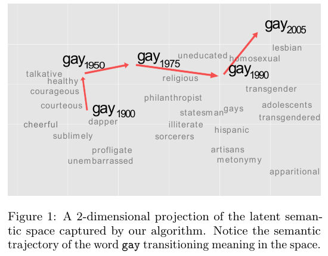

# Exemplos de Pesquisas em Humanidades Digitais
Para entender os potenciais das humanidades digitais para pesquisa, nada melhor que observarmos exemplos de pesquisas. Aqui seguem alguns de exemplos, selecionados pelo potencial de integração entre humanidades e métodos digitais, mais que quanto ao possível mérito/demérito científico.

## Bibliometria / cientometria / cienciometria
O estudo das citações, das rede de citações em artigos científicos foi talvez um dos pioneiros no uso de algumas das técnicas aqui descritas, existindo já há décadas. Chamada de "bibliometria", "cientometria" ou "cienciometria", ela conta citações de determinados autores em artigos científicos e tenta avaliar o quão influentes estes são.

### Exemplo: Filósofos da ciência na Sociologia
Por exemplo, HEDSTRÖM et al (1998), buscando saber a influência dos principais filósofos da ciência (Hempel, Kuhn, Popper e Wittgenstein) na sociologia em diferentes países e regiões (países nórdicos, EUA, Grã Bretanha, Alemanha e França), analisou o número de artigos nas principais revistas sociológicas que os citaram.

(Fonte: HEDSTRÖM et al. 1998. p. 343)

Pelos dados ali apresentados, Popper seria o filósofo mais influente na Europa, principalmente nos países de língua alemã, ao passo que Kuhn seria mais dominante nos EUA.

- HEDSTRÖM, Peter; SWEDBERG; and UDÉHN, Lars. Popper's Situational Analysis and Contemporary Sociology. Philosophy of the Social Sciences 1998; 28; 339-64]

### Exemplo: A teoria dos sistemas sociais de Niklas Luhmann
Stephen Roth analisou a chamada diferenciação funcional dos subsistemas da sociedade mundial, isto é, como os subssitemas como política, economia, religião, ciência, direito, meios de comunicação de massa, etc. se autonomizam em relação aos outros, entre os anos de 1800 e 2000, e para tal utilizou dados do Google Ngram viewer, que por sua vez se baseia no Google Books (mais detalhes sobre estas ferramentes na seção sobre frequência de palavras). Ele encontrou, por exemplo, declínio da presença relativa (isto é, proporcional a cada ano) da palavra "Deus" (_god_) nos livros em inglês ao longo do tempo.

 Fonte: Roth (2014, p.46).

E se examinarmos os termos relacionados aos Meios de Comunicação de Massa, podemos ver a importância relativa do termo "imprensa" (_press_) aumentando ao longo do tempo.

 Fonte: Roth(2014, p.47).

- Roth, Steffen. 2014. [“Fashionable Functions: A Google Ngram View of Trends in Functional Differentiation (1800-2000)”](https://citeseerx.ist.psu.edu/viewdoc/download?doi=10.1.1.692.7206&rep=rep1&type=pdf) International Journal of Technology and Human Interaction, 34–58. 

Uma versão posterior, um pouco mais elaborada em:

- Steffen Roth, Carlton Clark, Nikolay Trofimov, Artur Mkrtichyan, Markus Heidingsfelder, Laura Appignanesi, Miguel Pérez-Valls, Jan Berkel, Jari Kaivo-oja. [Futures of a distributed memory. A global brain wave measurement (1800–2000)](https://www.sciencedirect.com/science/article/abs/pii/S004016251730269X?via%3Dihub). Technological Forecasting & Social Change 118 (2017) 307–323

### Exemplo: Tendência de termos chave da Sociologia

<!-- Este tipo de pesquisa foi facilitada com a computação. -->
Além de contar citação nas referências, pode-se contar as palavras mais frequentes no corpo do texto e compará-las. Bernau (2018), por exemplo, coletou dados do [JSTOR’s Data for Research](https://www.jstor.org/dfr/) e plotou um gráfico longitudinal (ao longo do tempo) de frequência de palavas com termos chaves da sociologia, como "classe", "raça" e "gênero" da revista American Sociological Review.

Ele também disponibilizou o [script em R que desenvolveu](https://github.com/johnbernau/jstor_dfr) para esta análise.

- BERNAU, John A. [Text Analysis with JSTOR Archives](https://journals.sagepub.com/doi/full/10.1177/2378023118809264).  November 12, 2018. https://doi.org/10.1177/2378023118809264

### Exemplo: Tendências da filosofia

Inspirado neste trabalho, Brian Weatherson usou também o pacote  `jstor_dfr`, baixou dados da filosofia, e os clusterizou através de topic modeling. Podemos ver as tendências gerais de vários ramos da filosofia ao longo do tempo:

O resultado e mais informações estão em seu livro online: 

- WEATHERSON, Brian . [A History of Philosophy Journals](http://www-personal.umich.edu/~weath/lda/). Volume 1: Evidence from Topic Modeling, 1876-2013)

## Exemplo: Google Trends como Proxy para epidemias
A busca no Google por certos sintomas de doenças, ou melhor, a variação na busca por certas doenças e sintomas correlatos pode indicar que variação real da doença.
Isso acontece, por exemplo, com sintomas de gripe. Um pico no aumento das buscas pelos sintomas indica um prenúncio do aumento das infecções, a ser checado/validado posteriormente.
No artigo [Google Trends: A Web-Based Tool for Real-Time Surveillance of Disease Outbreaks.](https://academic.oup.com/cid/article/49/10/1557/298019), os autores explicam que a ferramenta lançada em 2018:
> "Google Flu Trends can detect regional outbreaks of influenza 7–10 days before conventional Centers for Disease Control and Prevention surveillance systems"
Para funcionar, há certas pré-condições sociais.

Vale para gripe, e a ferramenta também prevê aumentos da Covid-19.
Na reportagem da Piaui "[No carnaval, buscas por “sintomas covid” voltaram a subir; sete dias depois, número de novos casos bateu recorde](https://piaui.folha.uol.com.br/no-carnaval-buscas-por-sintomas-covid-voltaram-subir-sete-dias-depois-numero-de-novos-casos-bateu-recorde/)" de 09 de março de 2021 compara as buscas no google com casos reais.

ver também [“Sintomas Covid” en Google trends:.Un indicador alternativo para el seguimiento de la incidencia de casos.](https://smreputationmetrics.wordpress.com/2021/04/11/sintomas-covid-en-google-trends-un-indicador-alternativo-para-el-seguimiento-de-la-incidencia-de-casos/) com exemplos da Espanha, México, Chile e Argentina.

<!-- Exemplo de validação, de buscas no Google por "sintomas covid" e novos casos.
[Piaui:Buscas sintomas Google](https://piaui.folha.uol.com.br/wp-content/uploads/2021/03/minipost2_googlecovid_interna.jpg).-->

No entanto, a ferramenta que parecia promissora falhou em prever o pico de gripe de 2013, sobrestimando por 140%. A empresa achou melhor terminar o projeto, conforme um [artigo da Wired](https://www.wired.com/2015/10/can-learn-epic-failure-google-flu-trends/) de 2015. Mais detalhes podem lidos no artigo [The Parable of Google Flu: Traps in Big Data Analysis](https://dash.harvard.edu/bitstream/handle/1/12016836/The%20Parable%20of%20Google%20Flu%20%28WP-Final%29.pdf?sequence=1).
O Instituto de Ciências Cognitvas de Osnabrück leva a ideia adiante, com modelo mais complexo, utilizando dados de redes sociais como Twitter e através do Watson da IBM.([site do projeto](https://www.ikw.uni-osnabrueck.de/en/research_groups/neuroinformatics/overview/flu_prediction.html)).

## Exemplo: Como as fake news sobre a pandemia de Covid-19 se assemelham/divergem entre os países?
O relatório de 23/11/2020 sobre isolamento científico, intitulado "[scientific [self] isolation](https://laut.org.br/scientific-self-isolation/)" do [Laut](https://laut.org.br/), Centro de Análise da Liberdade e do Autoritarismo,
cruzou as checagens de fake news de 129 países diferentes (há uma plataforma que traduz as reportagens de fact checking de todo mundo para o inglês) e investigou a distribuição de notícias falsas sobre os tratamentos da Covid19. Os pesquisadores procederam então uma distribuição num plano das discussões nos países conforme sua semelhança. Quanto mais próximos, mais semelhantes os debates ao redor do tema. Encontraram então que o Brasil é o país mais isolado em sua discussão envolvendo certos medicamentos, no canto superior direito.
<!-- , ele identifica e se aprofunda sobre especificidades do debate público brasileiro, que se distancia da discussão internacional.-->

## Exemplo: Mudança de significado de palavras
Kulkarni et al (2015) mostraram como através de ferramentas computacionais é possível identificar a mudança de significado de termos, seja ao longo de um século (com dados do Google NGram), seja em dinâmicas mais rápidas, como no twitter. Um dos termos analisado foi o  "gay":

Várias outras palavras foram analisadas, como "tape" que significava "fita adesiva", mas passou a significar também "fita cassete" nos anos 1970; ou "apple" e "windows" que ganharam novo significado com a indústria da computação.

- KULKARNI, V., Al-Rfou, R; PEROZZI, B e SKIENA, S. [Statistically Significant Detection of Linguistic Change](http://viveksck.github.io/langchangetrack/data/kulkarni.pdf). WWW 2015, May 18–22, 2015. http://dx.doi.org/10.1145/2736277.2741627 .

## Exemplo: Análise de complexidade musical
A reportagem da Folha de São Paulo
[Música brasileira foi simplificada ao longo das décadas, diz pesquisa](https://www1.folha.uol.com.br/ilustrada/2017/08/1910208-musica-brasileira-foi-simplificada-ao-longo-das-decadas-diz-pesquisa.shtml)
cita o trabalho do cientista de dados Leonardo Sales ([blog do autor](leosalesblog.wordpress.com)), que analisou os acordes e vocabulário das letras, com base em 44 mil cifras e 102 mil letras raspadas de sites como cifras.com.br e letras.com.br em uma série de postagens: [parte 1](https://leosalesblog.wordpress.com/2017/04/21/analise-da-musica-brasileira-parte-1/), [parte 2](https://leosalesblog.wordpress.com/2017/04/21/analise-da-musica-brasileira-parte-2/), [parte 3](https://leosalesblog.wordpress.com/2017/04/26/analise-da-musica-brasileira-parte-3/) sobre as letras, [parte 4](https://leosalesblog.wordpress.com/2017/06/18/analise-a-musica-brasileira-parte-4/). Os códigos para raspagem de dados destes sites estão disponíveis em Python.

Como quase toda notação, há vantagens e desvantagens. Uma desvantagem, que levantou críticas, é que a análise se baseia em cifra, muito utilizada em músicas mais populares, mas inadequada para estilos mais complexos, como jazz. 
<!-- complexidade harmônica relativa d -->

<!--
## Riqueza vocabulário
Comparando riqueza vocabular em diferentes estilos musicais.
-->

## Exemplo: Polarização
Uma boa parte de pesquisas em política com métodos digitais se dedicou a analisar o fenômeno da polarização política. 

- Christopher A. Bail, Lisa P. Argyle, Taylor W. Brown, John P. Bumpus, Haohan Chen, M. B. Fallin Hunzaker, Jaemin Lee, Marcus Mann, Friedolin Merhout, and Alexander Volfovsky. 2018. Exposure to opposing views on social media can increase political polarization. Proceedings of the National Academy of Sciences 115, 37 (Sept. 2018), 9216–9221. https://doi.org/10.1073/pnas.1804840115 Publisher: National Academy of Sciences Section: Social Sciences.

Parte do trabalho de Franzosi descrevemos na [seção sobre dados estruturados](https://soaresalisson.github.io/SociologiaDigital/estrutura_dados.html#markup).

- Roberto P.  Franzosi. [Sociology, narrative, and the quality versus quantity debate (Goethe versus Newton): Can computer-assisted story grammars help us understand the rise of Italian fascism (1919–1922)?](https://www.researchgate.net/publication/226976976_Sociology_narrative_and_the_quality_versus_quantity_debate_Goethe_versus_Newton_Can_computer-assisted_story_grammars_help_us_understand_the_rise_of_Italian_fascism_1919-1922) . Theor Soc (2010) 39:593–629 DOI 10.1007/s11186-010-9131-3 

<!-- Usando uma abordagem estrutural de narrativa/gramática de histórias com auxílio computacional e coletando e analisando jornais, sendo 20 mil artigos de jornais fascistas, 32 mil de jornais socialistas.

I used PC-ACE to collect data on the rise of Italian fascism (1919–22), on the processes of working-class mobilization (1919–20, the “red years”) and fascist counter-mobilization (1921–22, the “black years”). I coded over 15,000 and over 17,000 newspaper articles from the socialist newspapers Il lavoro and Avanti!, and nearly 20,000 from the fascist newspaper Il Popolo d’Italia. The three databases resulted in over 17,000 semantic triplets from Il Lavoro, nearly 140,000 from Avanti!, and nearly 100,000 from Il Popolo d’Italia. 

Franzosi os codificou e extraiu triplets semânticos, utilizando o programa  PC-ACE.
As ações (verbos) mais frequentes, perpetradas por fascistas, em jornais socialistas,  são relacionados à violência (atirar, ferir, assaltar, bater, matar)
Ao separar sujeito, ação, objeto, encontrou que os típicos agentes de violência contra a esquerda eram os fascistas e a polícia.

Uso de PLN para verificar se havia agenda-setting no impeachment de Dilma Roussef.
ALL THE ROADS LEAD TO IMPEACHMENT: AGENDA SETTING AND DILMA ROUSSEFF’S PRESIDENTIAL CRISIS (2013-2016)
http://bibliotecadigital.fgv.br/dspace/handle/10438/29925
Pegando o gancho da Vaza Jato: na minha tese, defendida em out/2020, eu quis ver se a tal da agenda-setting colava no impeachment da Dilma. Sim: dados de PLN comprovam. E mostram que as menções a Lula superaram à Dilma o tempo TODO 

o tempo todo de análise (jan 2013- dez 2016) - com um pico exorbitante em março de 2016, mês dos históricos protestos de março de 2016. estas são menções na grande mídia, extraídas online para o período.
uma das coisas que as análises mostram, contraintuitivamente, é que a marca Lava Jato em si não tinha a importância esperada, mas aparecia dissolvida ao longo do range de análise em subagendas como corrupção, por exemplo
portanto, colegues jornalistas, grandes veículos, a barafunda Vaza Jato, o impeachment de Dilma e o assassinato da reputação do Lula são, em GRANDE MEDIDA, fruto do agendamento. não tem como falar de imparcialidade, nem razoabilidade. infelizmente.
-->

## Exemplo de integração quali-quanti: Complementando dados qualitativos
Uma dica de integração quali-quanti (qualitativo e quantitativo) usando análise textual vem do PEW Research. Aqui explicam como a partir de uma análise de grupos focais feita em 2019 com grupos dos EUA e da Grã Bretanha sobre atitudes frente a globalização/nacionalismo, complementaram com pesquisa quantitativa de análise textual, analisando as diferenças entre os grupos de cada país. Usaram técnicas como frequência de palavras, correlação de palavras e Topic modelling. Através destas análises, encontraram tópicos que se mostraram relevantes a serem incorporados em surveys futuros.

- DEVLIN, Kat.["How quantitative methods can supplement a qualitative approach when working with focus groups"](https://medium.com/pew-research-center-decoded/when-working-with-focus-groups-quantitative-methods-can-help-6ad39475ae5f). medium.
Dec 18, 2020. 

## Exemplo de integração quali-quanti: Depurando dados quantitativos
Nem sempre uma tabela de dados estruturados tem tudo estruturado, do modo que a sua pergunta de pesquisa necessite. Dentro de um campo específico de uma tabela pode-se precisar de desmembrar ainda mais os dados. Eis aqui um exemplo. Os pesquisadores do [Dadoscope](https://medium.com/dadoscope) queriam investigar se houve aumento na abertura de igrejas evangélicas durante os anos Lula e Dilma. Os pesquisadores baixaram dados da Receita Federal referente ao Cadastro Nacional de Pessoa Jurídica e filtraram por “94.91–0–00 — Atividades de organizações religiosas ou filosóficas" no campo “Classificação Nacional de Atividades Econômicas”. O problema é que isto agrega não só igrejas evangélicas, como também católicas e de outras religiões e até agremiações filosóficas e institutos de psicanálise. 
Aqui entra a integração:

> Para tentarmos realizar a classificação das 150 mil igrejas evangélicas de maneira semi-supervisionada nós usamos Snorkel, uma biblioteca escrita em Python... foi preciso treinar um algoritmo de classificação usando uma amostra dos dados. De forma sucinta, os dados são separados em amostras que são usadas para treino, teste e validação da classificação. Para classificar os mais de 150 mil nomes únicos presentes na amostra de treino, criamos funções que classificam de forma grosseira as igrejas (e.g., se a palavra “assembleia” estiver presente, classificar a igreja como “evangélica”). Depois de escrever dezenas dessas funções, comparamos sua acurácia com uma amostra de teste de 5% dos nomes únicos, manualmente classificados por dois pesquisadores. Feito isso, usamos uma rede neural que combina em camadas estas funções e _voilá_: 91.8% de acurácia. Sabemos que este resultado não é perfeito, mas ele torna o trabalho de classificação viável.

- O artigo completo "Exclusivo: Igrejas evangélicas pentecostais tiveram boom de crescimento nos governos Lula e Dilma" pode ser lido aqui: [artigo na Forum](https://revistaforum.com.br/blogs/dadoscope/exclusivo-igrejas-evangelicas-pentecostais-tiveram-boom-de-crescimento-nos-governos-lula-e-dilma/) e o [mesmo artigo na Medium](https://medium.com/dadoscope/o-crescimento-das-igrejas-pentecostais-nos-governos-de-lula-e-dilma-a7c40b5669bd).
- [Caderno de notas no dadoscope](https://github.com/dadoscope/igrejasevangelicas) para entender melhor como o processo foi realizado.
- Sobre a ferramenta utilizada, a Snorkel, ver a [página do Github](https://github.com/snorkel-team/snorkel), [introdução (em inglês) ao Snorkel](https://www.snorkel.org/use-cases/).

Por fim, outra dica para pensar a integração de dados quantitativos e qualitatovs é a palestra de [Dr. Christof Schöch: The Convergence of Quantitative and Qualitative Approaches](https://heibox.uni-heidelberg.de/d/1c606b33d5/?p=%2FDr.%20Christof%20Sch%C3%B6ch%3A%20The%20Convergence%20of%20Quantitative%20and%20Qualitative%20Approaches&mode=list), ocorrida no 1st Summerschool of Digital Humanities: Distant Reading - Potentials and Applications, em inglês.

